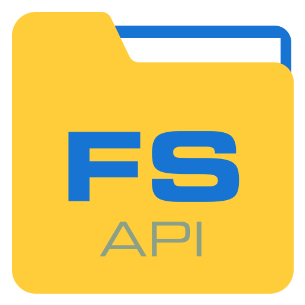
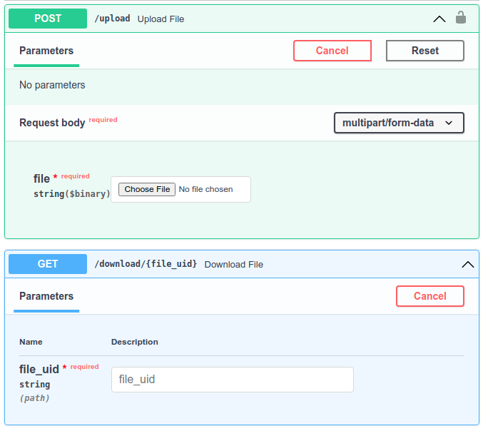

<div align="center">
  <br/>
  <h1> API File storage </h1>
  <p>File storage with API access. Used as a part of the <a href="https://gitlab.com/swipio">Swipio project</a></p>
</div>


## 📝 About The Project
File storage allows you to upload and download files using a simple API. This project can be used as a part of another project that needs to have a separate file storage

## ⚡️ Quick start

First of all, make sure you have [installed](https://www.python.org/downloads/) **Python**. Version `3.6` or higher is required.

Download the repository and change the current directory:
```bash
git clone https://gitlab.com/swipio/file_storage.git && cd file_storage
```

Configure virtual environment. Make sure a `.venv` folder has been created after this step.
```bash
make venv
```

Run the project:
```bash
make up
```

Open the website `http://localhost:5110/docs` to view the API documentation

### :whale: Docker-way to quick start

Create the storage folder:

```bash
mkdir storage
```

Run the container:

```bash
docker run --rm -it \
  -v "${PWD}/storage:/opt/app/storage" \
  -p 5110:80 \
  registry.gitlab.com/swipio/file_storage:latest
```

Open the website `http://localhost:5110/docs` to view the API documentation

## :book: API documentation

There are two endpoints: for uploading and for downloading files. You can find more information about the API on the website`http://localhost:5110/docs` (you need to run the project locally)

<div align="center">
  
</div>

## :computer: Contributors

<p>

  :mortar_board: <i>All participants in this project are undergraduate students in the <a href="https://apply.innopolis.university/en/bachelor/">Department of Computer Science</a> <b>@</b> <a href="https://innopolis.university/">Innopolis University</a></i> <br> <br>

  :boy: <b>Vladimir Markov</b> <br>
  &nbsp;&nbsp;&nbsp;&nbsp;&nbsp; Email: <a>v.markov@innopolis.university</a> <br>
  &nbsp;&nbsp;&nbsp;&nbsp;&nbsp; GitLab: <a href="https://gitlab.com/markovvn1">@markovvn1</a> <br>
</p>

## :scroll: License

`API File storage` is free and open-source software licensed under the [Apache 2.0 License](LICENSE)

